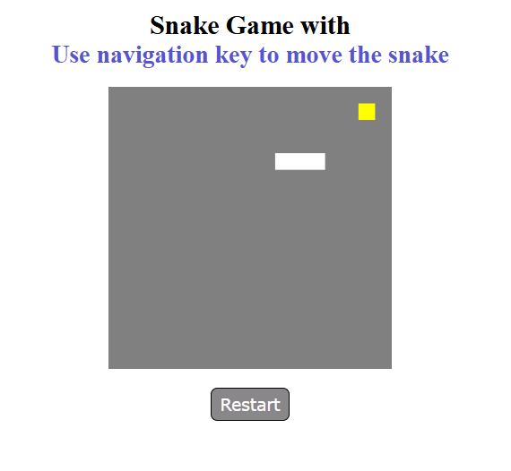
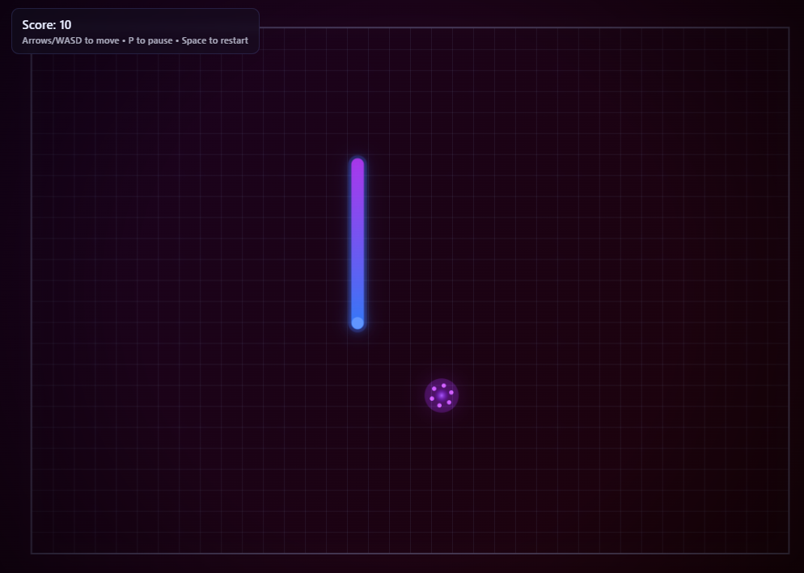
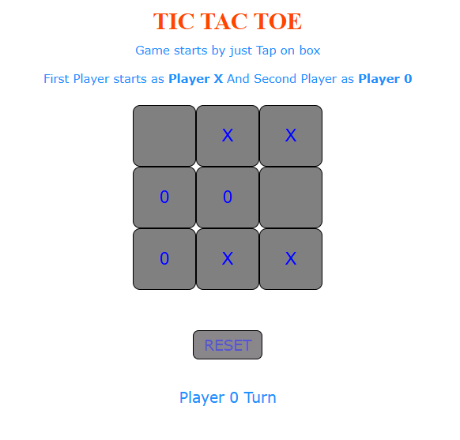

# 🕹️ HTML5 Games Collection

Welcome to my collection of web-based games! This repository contains classic games built using **HTML5, CSS3, and JavaScript**.

---

## 🚀 Projects Included

### 1. Snake Game
A classic arcade-style snake game where the goal is to eat food and grow without hitting the walls or yourself.
*   **Folder:** `/snake_game`
*   **Technologies:** JavaScript Canvas API, CSS Flexbox.

### 2. Tic-Tac-Toe
The timeless strategy game for two players. Features a clean UI and win-detection logic.
*   **Folder:** `/tic_toc_toe`
*   **Technologies:** DOM Manipulation, JavaScript Logic.

---

## 📸 Screenshots

Here are some previews of the games in action:

<br>
<br>

---

## 🛠️ How to Run Locally

1. **Clone the repository:**
   ```bash
   git clone https://github.com
